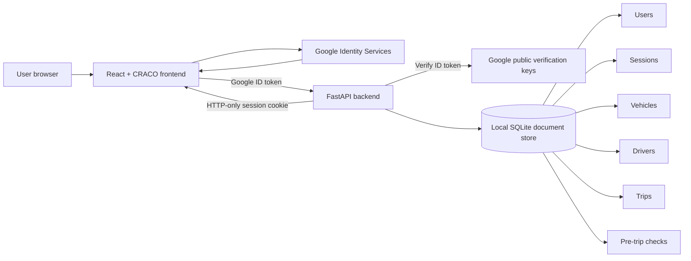
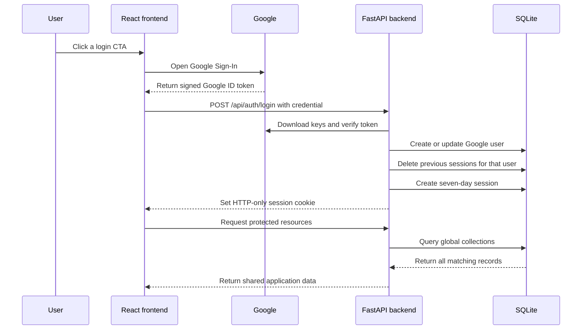
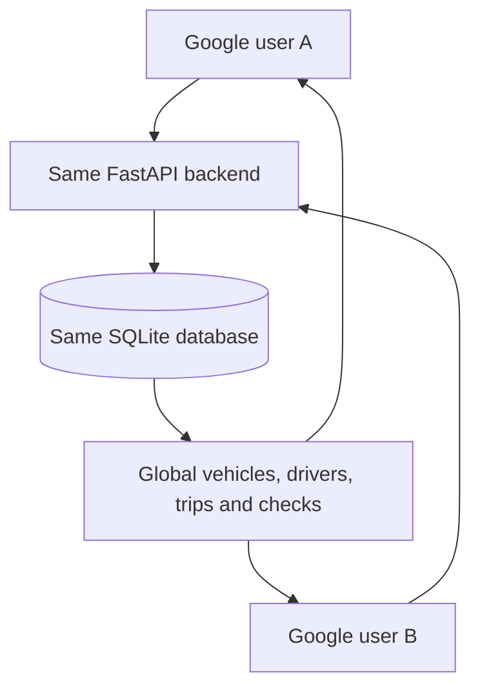
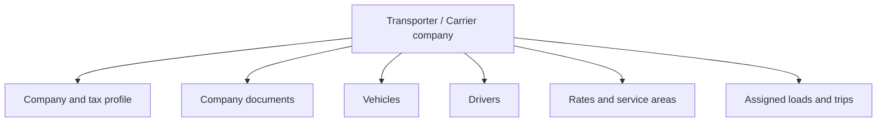
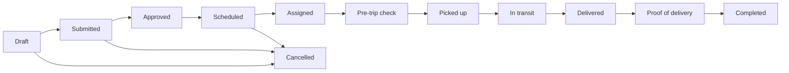
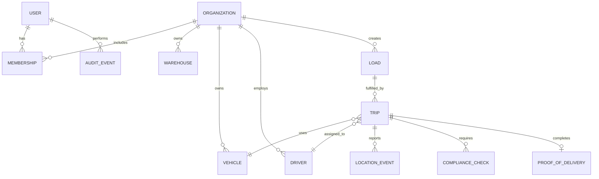
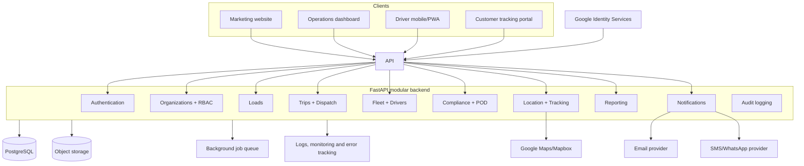

# BookMyLoad — Current-State Audit and Product Roadmap

**Audit date:** August 10, 2026  
**Repository:** BookMyLoad  
**Purpose:** Provide a single source of truth for what currently works, what is incomplete or simulated, what must be built, and the order in which the application should be taken to production.

> **Implementation update — compliance and notifications:** Tenant-scoped
> driver/vehicle documents, expiry classification, verification, protected file
> retrieval, critical allocation blocking, and an in-app notification center
> are implemented. Assignment, failed inspection, document upload, and delivery
> events generate targeted notifications. Migration `20260810_0005` and
> compliance/notification tests cover the milestone.

> **Implementation update — location picker:** Manual latitude/longitude entry
> has been replaced by address search, selectable results, a click/draggable
> OpenStreetMap marker, reverse geocoding, and current-device location. The
> backend proxy is authenticated, cached, throttled to the public Nominatim
> limit, identifies the application, and supports a configurable provider URL.

> **Implementation update — live tracking:** Browser GPS ingestion, sampled
> tenant-scoped location history, vehicle last position, OpenStreetMap/Leaflet
> operations mapping, route history, 500 m pickup/destination geofence
> suggestions, and stale/no-signal/low-accuracy alerts are implemented.
> Location updates are accepted only from the assigned driver while their trip
> is in progress. Migration `20260810_0004` and tracking isolation/geofence
> tests cover the milestone.

> **Implementation update — driver execution:** Drivers can now be linked to a
> dedicated Google-authenticated `driver` user through an invitation from the
> Drivers page. Their responsive workspace is restricted to assigned trips and
> enforces acceptance, a passed pre-trip inspection, ordered execution
> milestones, destination arrival, and proof of delivery before completion.
> Migration `20260810_0003` and driver authorization/lifecycle tests cover this
> milestone.

> **Implementation update — load-to-trip workflow:** Customer/location and
> transporter masters plus the complete load lifecycle are now implemented.
> Loads follow Draft → Submitted → Approved → Scheduled → Allocated → In
> Execution → Delivered → Closed, with rejection/cancellation branches.
> Allocation creates a tenant-owned linked trip and enforces availability,
> conflicts, and vehicle capacity. Trip execution synchronizes its parent load.
> The Loads UI and migration `20260810_0002` support the workflow end-to-end.

> **Implementation update — organization foundation:** The P0 organization
> foundation described in this audit has now been implemented. The application
> has SQLAlchemy models, Alembic migrations, PostgreSQL support, organizations,
> memberships, permission-based roles, invitation-only onboarding after the
> first owner, hashed multi-device sessions, organization switching, scoped
> operational queries, audit events, member-management UI, and tenant-isolation
> tests. Remaining sections document the original audit and subsequent roadmap.

---

## 1. Executive summary

BookMyLoad is currently a functional prototype of a transportation-management application. It has a React dashboard, a FastAPI backend, Google SSO, local session handling, and basic CRUD workflows for vehicles, drivers, trips, and pre-trip checks.

It is not yet ready for client production use. Its most important gaps are:

1. No organizations or tenant-level data separation.
2. Every Google user is automatically assigned the `admin` role.
3. All authenticated users connected to the same backend see the same operational data.
4. The Loads navigation item has no page, route, API, or database model.
5. Loads and trips are not modeled as separate business concepts.
6. Live tracking is a static image with simulated marker positions.
7. Several reports are based on hard-coded demonstration data.
8. Settings, notifications, support chat, export, and several map controls are visual-only.
9. SQLite is local to one machine and is not appropriate as the shared production database.
10. There are no deployment, migration, backup, monitoring, or meaningful end-to-end testing systems.

The recommended product direction is a multi-tenant logistics operations platform built as a modular monolith: React for the client applications, FastAPI for business APIs, PostgreSQL for transactional data, object storage for documents, and background workers for notifications and scheduled work.

---

## 2. Current technology stack

### Frontend

- React 19
- Create React App / React Scripts
- CRACO
- React Router
- Tailwind CSS
- Radix/Shadcn-style UI components
- Axios
- Recharts
- Google Identity Services

### Backend

- FastAPI
- Pydantic
- Google Auth Python library
- Uvicorn
- Custom Mongo-like document interface backed by SQLite

### Current storage

- Local SQLite database
- JSON documents stored in a generic `documents` table
- Database file: `backend/data/bookmyload.db`

### Authentication

- Google Sign-In button in the frontend
- Google ID-token verification in FastAPI
- Random opaque application session token
- Seven-day HTTP-only cookie
- Session records stored in SQLite

---

## 3. Current architecture



The frontend communicates with one FastAPI application. The backend reads and writes global collections. Operational records do not contain `organization_id`, `owner_id`, or another tenant boundary.

---

## 4. Current authentication flow



### What works

- Google login is operational.
- Google token signature, issuer, audience, expiry, and verified email are checked.
- Google `sub` is stored as the stable external identity.
- The application creates a server-side session.
- Protected backend endpoints require a valid session.
- Logout deletes the session and cookie.

### Authentication and authorization gaps

- Any eligible Google user can self-register.
- Every new user receives the `admin` role.
- The role is displayed but is never enforced.
- There is no invitation or approval flow.
- There is no organization membership.
- There is no user-management page.
- There is no session/device-management page.
- Signing in again deletes all earlier sessions for the same Google account.
- Session tokens are stored in plaintext instead of as hashes.
- There is no rate limiting or abuse protection.
- There is no audit history of login, logout, or administrative actions.

---

## 5. Current data-sharing behavior



- Different Google accounts connected to the same backend see the same data.
- The same Google account connected to the same backend sees the same data, although a new login currently invalidates its older session.
- Developers running the application on separate computers have separate SQLite files and do not automatically share data.
- A cloud database would synchronize data between environments, but data isolation still requires organizations and ownership filters.

---

## 6. Feature status matrix

| Feature | Status | Current behavior | Required work |
|---|---|---|---|
| Google SSO | Working | Google login and server session work | Add invitation, approval, roles, organizations, session management |
| Account creation | Partial | Automatic on first Google login | Add controlled onboarding and membership workflow |
| Roles | Missing | Every user is `admin` | Add permission-based RBAC |
| Multi-tenancy | Missing | All data is global | Add organizations, memberships, ownership and query filtering |
| Loads | Missing/broken | Sidebar link exists but route and implementation do not | Build complete load lifecycle |
| Vehicles | Basic working | CRUD and manual statuses work | Documents, maintenance, constraints, ownership and scheduling |
| Drivers | Basic working | CRUD and status changes work | Separate transporter company and driver models |
| Trips | Basic working | CRUD, assignment and statuses work | Valid transitions, conflict checks, transactions, POD and audit |
| Dispatch | Partial | Manual assignment from available lists | Schedule board, conflicts, capacity rules and reassignment |
| Live tracking | Simulated | Static image and fake marker coordinates | Real map, GPS ingestion, ETA and location history |
| Compliance | Partial | Pre-trip checklist can be submitted | History, evidence, failure handling and enforcement |
| Maintenance | Partial/model only | Vehicle status can be set to maintenance | Maintenance records, schedules, costs and reminders |
| Proof of delivery | Model only | Fields exist on Trip | Uploads, signatures, evidence and completion rules |
| Dashboard | Partially working | Live basic counts and trip summary | Exception queue, role-specific widgets, real KPIs |
| Reports | Mostly simulated | Some live totals; weekly and revenue data are hard-coded | Real analytical queries, filters and exports |
| AI insights | Mislabelled | Fixed rule-based recommendations | Relabel as alerts or implement grounded AI later |
| Settings | Mostly static | Profile displayed; most controls do nothing | Persist organization, security and notification settings |
| Notifications | Missing | Static Enabled badges only | Email, SMS/WhatsApp, push and in-app notification system |
| Support chat | Simulated | Fixed delayed response | Helpdesk integration, contact form or remove fake chat |
| Customer tracking | Missing | No public tracking experience | Secure tracking code and public shipment status page |
| Transporter portal | Missing | Driver page is labelled Transporters | Separate carrier company portal and workflows |
| Driver application | Missing | No driver-specific view | Mobile/PWA assignment, GPS, checklist and POD workflow |
| Localization | Partial | Landing page has several languages | Translate dashboard, validation, dates and notifications |
| Billing/invoices | Missing | Revenue chart is mock data | Define rates, charges, invoices, payments and margins |
| Search | Partial | Client-side search on loaded records | Server-side search, filters and pagination |
| Export | Missing | Export button has no behavior | CSV/PDF generation and permissions |
| Audit trail | Missing | No business history | Record sensitive and operational changes |
| Automated tests | Minimal | Three authentication tests | Full backend, frontend and end-to-end coverage |
| Deployment | Missing | Manual local startup | CI/CD, staging, production, backups and monitoring |

---

## 7. Loads module — required design

The Loads sidebar link currently points to `/dashboard/loads`, but the application has no matching page or nested route. The router falls through to the general fallback.

Loads and trips need to be modeled separately.

### Load

A load represents the commercial transport requirement:

- Requesting organization/warehouse
- Customer or consignee
- Pickup address and coordinates
- Delivery address and coordinates
- Intermediate stops
- Cargo type
- Weight and volume
- Vehicle requirements
- Pickup window
- Delivery deadline
- Handling instructions
- Rate, quote, or approved price
- Supporting documents
- Business status
- Assigned transporter

Suggested load states:

```text
Draft → Submitted → Approved → Scheduled → Allocated → In Execution → Delivered → Closed
                    ↘ Rejected/Cancelled
```

### Trip

A trip represents execution:

- Load or loads being carried
- Driver
- Vehicle
- Transporter
- Planned route
- Actual route
- Departure and arrival
- GPS events
- Pre-trip check
- Delivery proof
- Actual distance
- Costs and exceptions

A load may require several trips. Depending on the confirmed business model, one trip may also consolidate several compatible loads.

---

## 8. Fleet module — current gaps

Current vehicle CRUD is suitable for a demo but lacks production safeguards.

Required additions:

- Organization ownership
- Unique registration-number constraint
- Vehicle category and configuration
- Registration certificate
- Insurance details and expiry
- Permit details and expiry
- Pollution certificate and expiry
- Maintenance history
- Next-service rules
- Odometer history
- Fuel records
- Vehicle availability calendar
- GPS device identifier
- Document and image uploads
- Deactivation instead of unsafe deletion
- Prevention of deletion while assigned
- Audit history

Several fields already exist in the backend model, including maintenance dates, total trips, total kilometres, latitude, and longitude, but they are not supported by complete UI or business workflows.

---

## 9. Transporter and driver model

The current UI labels individual drivers as “Transporters.” These are different business entities.



### Driver fields and workflows that should be added

- Employing transporter
- Identity document
- License class and endorsements
- License verification status
- Availability schedule
- Assigned vehicle
- Driver app account
- Emergency details
- Location permission status
- Completed-trip metrics
- Incidents and compliance issues
- Rating calculated from real data

The current driver rating always begins at `5.0` and is never recalculated.

---

## 10. Trip and dispatch workflow

The current backend accepts status changes without enforcing a state machine.

A target execution workflow could be:



Required backend rules:

- Only valid state transitions are accepted.
- A trip cannot start without assignments.
- A driver cannot have overlapping active trips.
- A vehicle cannot have overlapping active trips.
- Unavailable or non-compliant resources cannot be assigned.
- Completion can require POD.
- Active or completed records cannot be silently deleted.
- Reassignment must restore old resource statuses correctly.
- Status changes must be transactional.
- Every change must record actor, time, old state and new state.

---

## 11. Live tracking requirements

The current map is a photograph. Vehicle markers use five hard-coded CSS positions. Zoom and fullscreen controls do not perform map actions.

A real tracking feature requires three layers.

### A. Map and route display

- Google Maps or Mapbox map
- Address autocomplete
- Geocoding
- Route polylines
- Marker clustering
- Pickup and delivery markers
- Traffic and route information where required

### B. Position source

Choose one or more:

- Driver phone/PWA GPS
- Existing fleet GPS provider
- Dedicated hardware tracker
- Manual operations updates as a fallback

### C. Tracking backend

- Secure location-update endpoint
- Latest position per vehicle/trip
- Time-stamped location events
- Route history
- ETA calculation
- Pickup/delivery geofences
- Stale-location detection
- Offline-device alert
- Permission and privacy controls
- Configurable data retention

Google Maps displays and calculates routes; it does not independently provide vehicle locations. A phone or hardware device must send coordinates.

---

## 12. Compliance, documents and proof of delivery

### Current behavior

- Assigned trips can open a checklist.
- The checklist can record simple booleans and notes.
- Driver license expiry and maintenance status are shown as alerts.

### Missing behavior

- Checklist history UI
- Duplicate prevention or version rules
- Mandatory checklist before trip start
- Failed-check workflow
- Corrective actions
- Inspector/driver signature
- Evidence photos
- Company and vehicle documents
- Expired-versus-expiring classification
- Notifications
- Audit records
- POD photo
- Recipient signature
- Delivery timestamp and coordinates
- Delivery notes and exceptions

---

## 13. Reporting and analytics

### Current live data

- Total vehicles
- Available vehicles
- Total drivers
- Available drivers
- Active trips
- Completed trips today
- Trips grouped by status

### Current simulated or incomplete data

- Weekly trip activity is hard-coded.
- Monthly revenue is hard-coded.
- Report period selection does not filter data.
- Export does nothing.
- `total_km_today` always returns zero.
- AI insights are fixed rules and do not understand the user's question.

### Required reporting

- Load volume by time period
- On-time pickup and delivery
- Delayed and cancelled work
- Fleet utilization
- Empty kilometres
- Driver utilization
- Maintenance downtime
- Document expiry
- Customer performance
- Transporter performance
- Revenue, carrier cost and margin if commercial data is in scope
- Date, customer, transporter, region and status filters
- CSV and PDF export
- Scheduled reports

The existing “AI” feature should be renamed to “Operational alerts” until a real model is connected to trusted data and permission-safe retrieval.

---

## 14. Settings and notifications

The Settings page currently displays hard-coded company information and notification preferences. Appearance, Security and Notifications actions are not implemented.

Required settings areas:

- Organization profile
- Warehouses and operating locations
- Users, invitations and memberships
- Roles and permissions
- Notification preferences
- Integration settings
- Branding
- Security and active sessions
- Audit log
- Data export and deletion
- Billing/subscription settings if relevant

Notification channels may include:

- In-app notifications
- Email
- SMS
- WhatsApp
- Push notifications for a driver PWA/app

Common events include assignment, delay, trip start, delivery, document expiry, maintenance due, checklist failure, and POD availability.

---

## 15. Proposed organization and permission model

Use organizations as the data-ownership boundary.



Every owned record should include an `organization_id`. Permission checks must derive allowed organizations from the authenticated user's memberships. The API must not trust a user-supplied organization identifier without verifying membership.

### Suggested roles

| Role | Intended access |
|---|---|
| Platform Super Admin | All BookMyLoad customers and platform operations |
| Organization Owner | Company settings, users, billing and all organization data |
| Operations Admin | Loads, trips, fleet, drivers, compliance and reports |
| Dispatcher | Create loads, schedule trips and assign resources |
| Warehouse User | Create and monitor the warehouse's loads |
| Transporter Admin | Manage transporter profile, fleet, drivers and assigned work |
| Driver | Only assigned trips, checklist, GPS updates and POD |
| Finance | Rates, invoices, payments and financial reports |
| Viewer | Read-only organization access |
| Tracking User | Restricted shipment visibility |

Roles should map to explicit permissions rather than scattered role-name checks.

---

## 16. Proposed target architecture

A modular monolith is recommended initially. Microservices would add deployment and operational complexity without solving the current product gaps.



### Recommended infrastructure

- PostgreSQL
- SQLAlchemy ORM
- Alembic database migrations
- Object storage for documents and POD
- Background task queue for alerts, notifications and reports
- Managed secrets/environment variables
- Separate local, development, staging and production environments
- Automated database backups
- Structured logs
- Error monitoring
- Health and readiness checks
- CI/CD pipeline

SQLite may remain as a lightweight test/local option, but shared development and production should use PostgreSQL.

---

## 17. Database model direction

Likely core tables:

- `users`
- `organizations`
- `memberships`
- `roles`
- `permissions`
- `invitations`
- `warehouses`
- `customers`
- `transporters`
- `drivers`
- `vehicles`
- `vehicle_documents`
- `driver_documents`
- `loads`
- `load_stops`
- `load_documents`
- `quotes` or `allocations`, depending on the business model
- `trips`
- `trip_loads`
- `trip_assignments`
- `trip_status_events`
- `location_events`
- `compliance_checks`
- `proofs_of_delivery`
- `maintenance_records`
- `notifications`
- `notification_preferences`
- `audit_events`
- `rates`, `invoices` and `payments` if commercial workflows are included

The relational database should enforce unique constraints, foreign keys, required relationships, and transactional updates.

---

## 18. Security gaps and requirements

### Current high-risk gaps

1. Any Google user can create an account.
2. Every account becomes an administrator.
3. All users access the same operational data.
4. Role values are never checked.
5. No invitation or approval workflow exists.
6. Session tokens are stored in plaintext.
7. There is no rate limiting.
8. There is no audit trail.
9. There is no device/session management.
10. Production secure-cookie behavior depends on manual configuration.
11. There are no database constraints or foreign keys.
12. There is no retention, export or deletion policy.

### Production security requirements

- Invitation or approval-based registration
- Permission-based RBAC
- Tenant isolation on every query
- Hashed session tokens
- Session expiration, revocation and device listing
- Secure, HTTP-only cookies in production
- CSRF strategy for cookie-authenticated mutations
- Strict CORS and trusted-host configuration
- Security headers
- API rate limiting
- Input and upload validation
- Audit logging
- Principle-of-least-privilege infrastructure access
- Secrets stored outside source control
- Dependency scanning
- Backup encryption
- Privacy and retention policies
- Incident response and recovery process

---

## 19. Frontend dependency and build-system status

The current npm audit reports:

- 60 total vulnerabilities
- 13 low
- 15 moderate
- 30 high
- 2 critical

Many findings originate from the older Create React App/webpack toolchain, while some affect direct dependencies such as Axios.

Recommended response:

1. Do not apply `npm audit fix --force` blindly.
2. Upgrade direct runtime dependencies.
3. Migrate from Create React App/CRACO to a maintained build setup such as Vite.
4. Remove unused UI and 3D dependencies.
5. Re-run security, build and browser tests.
6. Add automated dependency updates and audit checks to CI.

---

## 20. Testing and quality plan

Current reliable automated coverage is limited to three Google-authentication tests.

### Backend tests required

- Google authentication success and failure
- Invitation and membership flow
- Role permissions
- Tenant isolation
- Load CRUD and lifecycle
- Vehicle and driver constraints
- Dispatch conflicts
- Valid and invalid trip transitions
- Transaction rollback behavior
- Compliance enforcement
- POD workflow
- Search, filtering and pagination
- Session expiry and revocation
- Rate limiting and validation

### Frontend tests required

- Route guards
- Login modal behavior
- Role-specific navigation
- Forms and validation
- Empty, loading and error states
- Table filtering and pagination
- Responsive navigation
- Accessibility and keyboard behavior

### End-to-end tests required

- Admin invites a user
- Warehouse creates a load
- Dispatcher assigns transporter, vehicle and driver
- Driver completes pre-trip check
- Driver starts trip and sends locations
- Customer views tracking
- Driver uploads POD
- Operations closes load
- Unauthorized organization cannot view another organization's records

### CI quality gates

- Formatting
- Linting
- Type checks
- Backend tests
- Frontend tests
- End-to-end smoke tests
- Production build
- Dependency audit
- Migration validation

---

## 21. Homepage redesign plan

The current homepage has useful brand colors and content but is long, repetitive, reliant on stock images, and contains claims that must be verified. Almost every CTA opens the same login flow even when the labels imply different user journeys.

### Proposed structure

```text
Navigation
  Logo | Solutions | How It Works | Tracking | About | Contact | Sign In

Hero
  Clear managed-logistics value proposition
  Primary: Request Transport
  Secondary: Join as Transporter
  Real product visual or purpose-built logistics illustration

Trust strip
  Verified customers, operating regions and credentials

Role-based solutions
  For Warehouses
  For Transporters

Managed workflow
  Request → Plan → Assign → Track → Deliver → POD

Platform capabilities
  Loads, Dispatch, Fleet, Tracking, Compliance, Reporting

Product preview
  Real dashboard and tracking screenshots

Why BookMyLoad
  Managed operations, visibility, accountability and support

Verified case studies/testimonials

Coverage, FAQ and contact

Final CTA and legal footer
```

### Design direction

- Retain navy, orange and white as the brand foundation.
- Reduce repetitive orange blocks.
- Use a clean logistics command-centre visual language.
- Keep public pages light and trustworthy.
- Keep operational dashboards dense and data-focused.
- Use owned product imagery instead of runtime stock-image URLs.
- Establish reusable typography, spacing, button and card tokens.
- Add complete loading, empty, error and success states.
- Use tables on desktop and task-focused cards on mobile.
- Preserve intended action through login.
- Add accessible contrast, focus, labels and keyboard interaction.
- Respect reduced-motion preferences.
- Avoid unsupported “#1” or customer-volume claims until verified.
- Replace placeholder contact details and outdated copyright dates.

---

## 22. Dashboard redesign plan

The dashboard should be an operational command centre rather than a collection of generic statistic cards.

```text
Primary KPIs
  Active loads | In transit | Delayed | Unassigned | Compliance alerts

Attention queue
  Unassigned loads
  Delayed trips
  Failed checks
  Expiring documents
  Maintenance due

Live operations
  Real map
  Active routes
  Pickup and delivery events

Today's schedule
  Upcoming pickups
  Resource assignments
  Capacity conflicts

Performance
  On-time delivery
  Fleet utilization
  Empty kilometres
  Exception trend

Recent activity
  Actor, action, entity and timestamp
```

Each role should see a different dashboard. A driver does not need the same information as a platform administrator or warehouse user.

---

## 23. Product decisions required before major implementation

The client should confirm these questions before the data model and redesigned workflows are finalized:

1. Is BookMyLoad an internal operations application, a multi-company SaaS platform, or both?
2. Who can log in: BookMyLoad employees, warehouses, transporters, drivers and/or customers?
3. Does BookMyLoad centrally allocate transporters, or can transporters browse and bid?
4. Can one load require multiple trips?
5. Can one trip consolidate multiple loads?
6. Who sets, negotiates and approves pricing?
7. Are quotes, invoices, payments and commissions in scope?
8. Is GPS sourced from driver phones or existing devices?
9. Which documents and compliance rules apply in India and Australia?
10. Should customers have public tracking links?
11. Which languages are required inside the application?
12. Who can see rates, costs and margins?
13. Which homepage claims, statistics and testimonials are approved?
14. How long should location and operational data be retained?

---

## 24. High-level implementation sequence

The following order minimizes rework and should be followed step by step.

### Step 1 — Product definition

- Conduct a client workflow workshop.
- Confirm users, organizations and business model.
- Define load and trip lifecycle.
- Confirm transporter-allocation model.
- Confirm pricing/payment scope.
- Confirm GPS source.
- Approve the MVP feature list.
- Produce wireframes and acceptance criteria.

**Exit condition:** Signed-off product scope and workflow diagrams.

### Step 2 — Engineering foundation

- Define backend module boundaries.
- Set up PostgreSQL.
- Add SQLAlchemy and Alembic.
- Define local, test, staging and production configurations.
- Add structured logging and error handling.
- Establish CI checks.
- Migrate frontend from CRA/CRACO if approved.
- Update vulnerable dependencies.

**Exit condition:** Repeatable local setup, migrations and clean CI build.

### Step 3 — Organizations, users and RBAC

- Create organizations and memberships.
- Create invitation/approval workflow.
- Define roles and permissions.
- Stop automatic administrator assignment.
- Add tenant context to protected requests.
- Add user-management UI.
- Add audit records.
- Add session management.

**Exit condition:** Two organizations cannot access each other's data, verified by automated tests.

### Step 4 — Core master data

- Add warehouse/customer entities.
- Add transporter companies.
- Upgrade vehicle model.
- Upgrade driver model.
- Add documents and expiry tracking.
- Add server-side pagination, search and filters.

**Exit condition:** Organizations can safely manage their real master data.

### Step 5 — Loads

- Create load schema and APIs.
- Create load forms and list/detail pages.
- Add stops, cargo, windows and requirements.
- Add documents.
- Add load status workflow.
- Add assignment/allocation model.
- Add activity timeline.

**Exit condition:** A valid load can be created, approved and prepared for execution.

### Step 6 — Dispatch and trips

- Link loads to trips.
- Add scheduling and dispatch board.
- Add driver and vehicle conflict checks.
- Enforce valid trip transitions.
- Make assignment/status operations transactional.
- Add exceptions, notes and history.

**Exit condition:** A load can be assigned and executed without inconsistent resource states.

### Step 7 — Compliance and POD

- Add document expiry workflows.
- Enforce pre-trip checks.
- Add failed-check resolution.
- Add photo uploads.
- Add recipient signature and POD.
- Add completion requirements.

**Exit condition:** Trips have an auditable compliance and delivery record.

### Step 8 — Maps and live tracking

- Select map provider.
- Add address autocomplete and geocoding.
- Implement GPS source.
- Add location-event ingestion.
- Add real map, routes and ETA.
- Add geofence and stale-location alerts.
- Add customer tracking portal.

**Exit condition:** A real trip can be followed from pickup to delivery.

### Step 9 — Notifications

- Add notification events and templates.
- Add in-app notifications.
- Add email.
- Add SMS/WhatsApp if required.
- Add user preferences and retry handling.

**Exit condition:** Important operational events reliably notify the correct users.

### Step 10 — Reports and commercial features

- Replace demonstration charts.
- Add reporting queries and filters.
- Add exports.
- Calculate utilization and delivery KPIs.
- Add rates, invoices, payments and margins if approved.
- Add scheduled reports.

**Exit condition:** All displayed numbers are derived from real tenant-scoped data.

### Step 11 — UI/UX redesign

- Finalize design system.
- Rebuild homepage.
- Rework navigation and information architecture.
- Build role-specific dashboards.
- Improve forms and responsive behavior.
- Add accessibility compliance.
- Replace mock content and stock dependencies.

This can partially overlap with earlier work, but final operational screens should follow approved workflows rather than precede them.

**Exit condition:** Consistent, accessible, mobile-friendly client-approved experience.

### Step 12 — Production readiness

- Complete automated test suites.
- Establish staging environment.
- Add production CI/CD.
- Add backups and recovery tests.
- Add monitoring and alerts.
- Add security headers and rate limiting.
- Conduct dependency and application security review.
- Add privacy policy, terms and data-retention processes.
- Complete production Google OAuth configuration.
- Run performance, accessibility and user-acceptance testing.

**Exit condition:** Production launch checklist signed off by engineering and client stakeholders.

---

## 25. Priority roadmap

### P0 — Must be done before real client data

- Product decisions
- PostgreSQL and migrations
- Organizations and memberships
- RBAC
- Tenant isolation
- Controlled onboarding
- Dependency/build modernization
- Audit logging foundation

### P1 — Core MVP

- Loads
- Warehouses/customers
- Transporter companies
- Enhanced fleet and drivers
- Dispatch and validated trips
- Search, pagination and activity history

### P2 — Operational completion

- Compliance
- Maintenance
- POD
- Notifications
- Real dashboard alerts

### P3 — Tracking and portals

- Maps
- GPS integration
- Driver PWA/app
- Customer tracking portal

### P4 — Commercial and analytical capabilities

- Real reports
- Exports
- Rates and costs
- Invoices/payments if required
- Data-grounded AI assistance if justified

Commercial workflow status (implemented 2026-08-10):

- One tenant-scoped quotation per load with itemized charges, tax calculation,
  validity, terms, and draft/sent/accepted/rejected states
- Accepted quote synchronized to the load's quoted amount
- One invoice per delivered load, generated from the accepted quote or a
  manually supplied subtotal
- Draft/issued/partially-paid/paid lifecycle, due-date and overdue visibility
- Multiple manual payment records with method and reference; overpayments are
  rejected
- Permission enforcement, tenant isolation, audit events, notifications, and
  automated backend coverage

Trip expense and profitability status (implemented 2026-08-10):

- Categorized estimated and actual trip expenses with receipt evidence
- Draft, submitted, approved, and rejected expense states
- Owner/operations approval and audit/notification records
- Pre-tax revenue, pending exposure, approved actual cost, trip profit, and
  margin calculations
- Tenant isolation and automated backend coverage

Reporting and analytics status (implemented 2026-08-11):

- Real filtered operational and financial KPIs with no mock chart data
- Revenue, collection, outstanding, approved-cost, profit, and margin reporting
- Load/trip statuses, on-time delivery, customer, driver, and vehicle analysis
- Expense-category and invoice-ageing analysis
- Drill-down tables, shared-calculation CSV exports, and browser PDF printing
- Tenant-isolation, calculation, filter, and export tests

Email notification status (implemented 2026-08-11):

- Provider-neutral SMTP delivery with HTML and plain-text messages
- Durable tenant-scoped outbox, delivery history, retries, and error visibility
- Transactional emails derived from operational notifications
- Invoice, compliance, delayed-load, and expense-approval scheduled reminders
- Organization settings, manual test/scan controls, and deduplication
- Automated background worker and test coverage

Still remaining in P4: branded document PDFs, credit notes/refunds, customer portal,
and an optional payment-gateway integration if the client later requires it.

### P5 — Production launch

- Complete testing
- Security review
- CI/CD
- Backups
- Monitoring
- Legal/privacy documentation
- Performance and accessibility validation
- Production OAuth and domain configuration

---

## 26. Definition of production-ready

BookMyLoad should not be considered production-ready until all of the following are true:

- Users belong to organizations.
- Roles and permissions are enforced on the backend.
- Tenant-isolation tests pass.
- Real loads and trips have separate workflows.
- Critical state transitions are validated and transactional.
- The production database has migrations and backups.
- Documents are stored securely.
- No mock reports or tracking are presented as real.
- Security-sensitive actions are audited.
- Rate limiting and secure headers are enabled.
- Sessions can be revoked.
- Production secrets are managed securely.
- Monitoring and error alerts are active.
- Core user journeys have automated end-to-end tests.
- Accessibility and responsive checks pass.
- Privacy, terms, retention and deletion policies exist.
- A staging environment has passed client UAT.
- Recovery from backup has been tested.

---

## 27. Recommended starting point

When development resumes, begin with **Step 1: Product definition**, not maps or isolated visual changes.

The first implementation milestone should then be:

1. PostgreSQL and migrations
2. Organizations and memberships
3. Permission-based RBAC
4. Tenant isolation
5. Loads as a first-class module

This foundation determines how every later feature stores, secures and presents its data. Starting elsewhere would likely cause avoidable rework.
