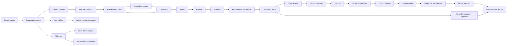
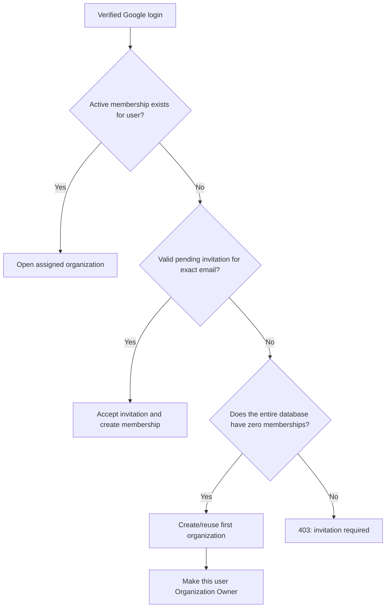
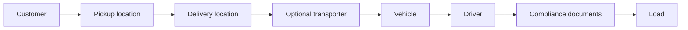
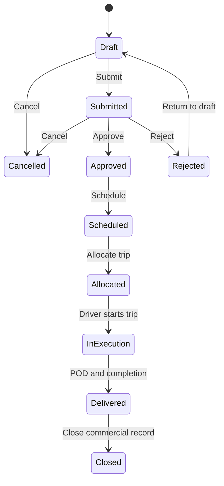
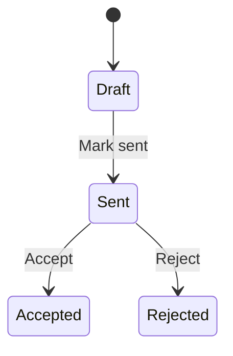
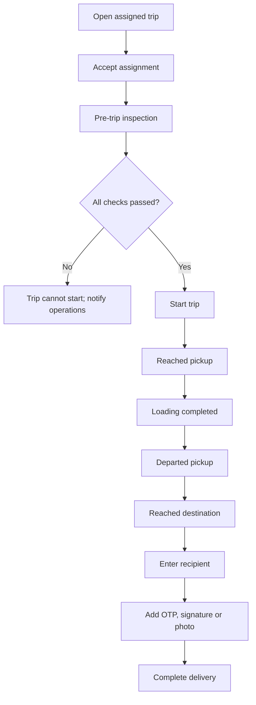
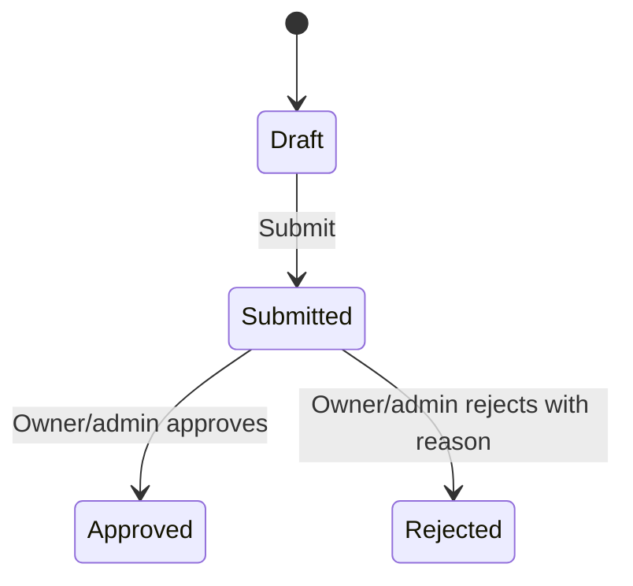
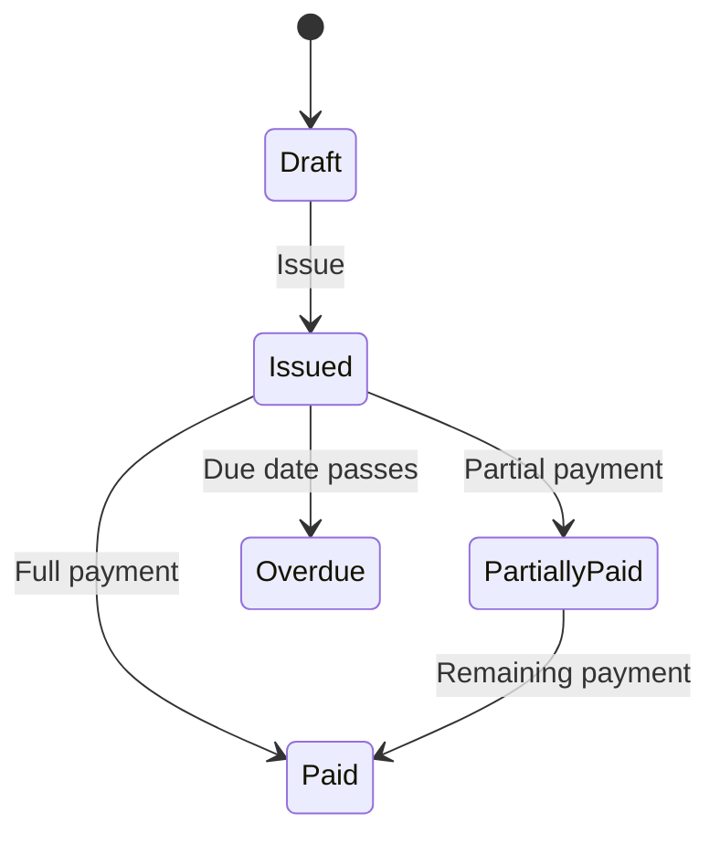

# BookMyLoad: From-Scratch Onboarding and Complete Demo Flow

This runbook explains exactly how to prepare and demonstrate BookMyLoad from an empty application. It includes navigation paths, example data, dependencies, status changes, and expected results.

> Use fictional information during a client demonstration. Do not expose `.env` values, OAuth credentials, real customer information, or production documents.

## 1. Complete business flow



## 2. Demo dataset

Use one consistent story throughout the demonstration.

| Record | Example data |
|---|---|
| Organization | BookMyLoad Demo Logistics |
| Owner | Your authorized Google account |
| Customer | Acme Retail Pvt Ltd |
| Customer contact | Ananya Sharma |
| Phone | +91 98765 41001 |
| Email | logistics@acme-demo.example |
| GST number | 27ABCDE1234F1Z5 |
| Billing address | Andheri East, Mumbai, Maharashtra |
| Pickup location | Mumbai Distribution Centre |
| Pickup address | MIDC, Andheri East, Mumbai, Maharashtra 400093 |
| Delivery location | Pune Central Warehouse |
| Delivery address | Hinjawadi Phase 1, Pune, Maharashtra 411057 |
| Transporter | SwiftLine Transport Services |
| Transporter contact | Vikram Patil, +91 98765 42002 |
| Service areas | Maharashtra, Gujarat, Goa |
| Vehicle | MH12AB1234, Truck, Tata Prima, 2024, 25 tons, Diesel |
| Driver | Ramesh Kumar, +91 98765 43003 |
| Driver licence | MH0120200012345, future expiry date |
| Load reference | BML-DEMO-001 |
| Cargo | Packaged consumer goods, 10 tons, quantity 100 |
| Quotation | Base ₹35,000; fuel ₹3,000; toll ₹1,500; handling ₹500; tax 18% |
| Expense | Fuel ₹8,000 and toll ₹1,500 |
| POD recipient | Priya Deshmukh |

## 3. Start the application

Prerequisites:

- Python 3.11 or newer
- Node.js 20 or newer
- Google OAuth Web client configured for `http://localhost:3000`
- The same Google client ID in the backend and frontend environment files

### Terminal 1: backend

```powershell
cd D:\freelance\BML\BML\backend
python -m venv .venv
.\.venv\Scripts\python.exe -m pip install -r requirements.txt
.\.venv\Scripts\python.exe -m alembic -c alembic.ini upgrade head
.\.venv\Scripts\python.exe -m uvicorn server:app --reload --host 127.0.0.1 --port 8000
```

### Terminal 2: frontend

```powershell
cd D:\freelance\BML\BML\frontend
npm install --legacy-peer-deps
npm start
```

Open:

- Application: <http://localhost:3000>
- API documentation: <http://localhost:8000/docs>

## 4. Organization owner and first login

### Actual application rule



Only the first membership in an empty database is created automatically as `organization_owner`. A new Google account does **not** become an owner after another membership already exists.

### Why “invitation required” appeared

The current database already contains at least one membership. Your new Google account had neither:

1. an existing active membership, nor
2. a non-expired pending invitation matching the exact lowercase Google email.

The backend therefore returned: `No organization access. Ask an organization owner for an invitation.`

### Normal solution

1. Sign in using the Google account that originally became Organization Owner.
2. Open the profile menu in the top-right corner.
3. Select **Settings**.
4. In **Organization Access**, enter the new user’s exact Google email.
5. Select a role: Organization Owner, Operations Admin, Dispatcher, or Viewer.
6. Create the invitation.
7. Sign out or use a private browser window.
8. Sign in with the invited Google account.
9. The pending invitation is accepted automatically and the membership becomes active.

For a driver, create the driver profile first and use **Drivers → menu → Invite to driver app**. This links the Google membership to that driver profile.

### Development-only clean start

If this is a disposable local demo database and the original owner is unavailable, back up the SQLite database before resetting it. A genuinely empty database will make the first verified Google login the new Organization Owner after migrations are applied. Do not reset a client or production database for this purpose.

> `PLATFORM_ADMIN_EMAILS` does not replace organization membership during login. A platform-admin email still needs an active membership or valid invitation when memberships already exist.

## 5. Create the master data first

The recommended order is:



### 5.1 Add a customer

Navigation: **Loads → Customers → Add Customer**

Enter:

| Field | Example | Requirement |
|---|---|---|
| Company name | Acme Retail Pvt Ltd | Required |
| Contact person | Ananya Sharma | Required |
| Phone | +91 98765 41001 | Required |
| Email | logistics@acme-demo.example | Optional |
| GST number | 27ABCDE1234F1Z5 | Optional |
| Billing address | Andheri East, Mumbai | Optional |

Click **Save**.

Expected result: the customer card appears in the Customers tab.

### 5.2 Add the pickup location

Navigation: **Loads → Customers → customer card → Location**

Enter:

| Field | Example |
|---|---|
| Location name | Mumbai Distribution Centre |
| Address | MIDC, Andheri East |
| City | Mumbai |
| State | Maharashtra |
| Postal code | 400093 |
| Contact person | Suresh Nair |
| Contact phone | +91 98765 44004 |

Use one location method:

- Search the address and select a result.
- Click the required point on the map.
- Drag the marker to refine the position.
- Use the browser’s current location when appropriate.

Click **Save**.

### 5.3 Add the delivery location

Repeat **Loads → Customers → customer card → Location**.

Use:

| Field | Example |
|---|---|
| Location name | Pune Central Warehouse |
| Address | Hinjawadi Phase 1 |
| City | Pune |
| State | Maharashtra |
| Postal code | 411057 |
| Contact person | Priya Deshmukh |
| Contact phone | +91 98765 45005 |

Expected result: the customer now has at least two selectable locations.

### 5.4 Add an external transporter (optional)

Navigation: **Loads → Transporters → Add Transporter**

| Field | Example | Requirement |
|---|---|---|
| Company name | SwiftLine Transport Services | Required |
| Contact person | Vikram Patil | Required |
| Phone | +91 98765 42002 | Required |
| Email | operations@swiftline-demo.example | Optional |
| GST number | 27AAECS1234G1Z2 | Optional |
| Service areas | Maharashtra, Gujarat, Goa | Optional |

A transporter is the carrier responsible for moving goods. Leave it blank on the load when using only your own fleet.

### 5.5 Add a vehicle

Navigation: **Fleet → Add Vehicle**

| Field | Example |
|---|---|
| Registration number | MH12AB1234 |
| Vehicle type | Truck |
| Make | Tata |
| Model | Prima |
| Year | 2024 |
| Capacity | 25 tons |
| Fuel type | Diesel |
| Current location | Mumbai Depot |
| Status after saving | Available |

The vehicle must be **Available**, have enough capacity for the load, and pass compliance checks before allocation.

### 5.6 Add a driver

Navigation: **Drivers → Add Driver**

| Field | Example |
|---|---|
| Full name | Ramesh Kumar |
| Phone | +91 98765 43003 |
| Email | Driver’s actual Google email for login |
| Licence number | MH0120200012345 |
| Licence expiry | A future date |
| Address | Mumbai, Maharashtra |
| Emergency contact | +91 98765 46006 |
| Status after saving | Available |

To give portal access: open the driver card menu and select **Invite to driver app**. Enter the driver’s exact Google email.

### 5.7 Add compliance documents

Navigation: **Compliance → Upload**

Prepare small fictional PDF/image files, maximum 5 MB.

For the driver, upload relevant records such as:

- Driving licence
- Identity document
- Medical document

For the vehicle, upload relevant records such as:

- Registration certificate
- Insurance
- Fitness certificate
- Pollution certificate
- Permit

Enter document number, issue date, and a future expiry date. After upload, verify the document using **Verify**.

Expected result: critical documents are valid/verified, so allocation is not blocked.

## 6. Create and progress the load

Navigation: **Loads → Loads → New Load**

| Field | Example |
|---|---|
| Reference | BML-DEMO-001 |
| Customer | Acme Retail Pvt Ltd |
| Pickup | Mumbai Distribution Centre |
| Delivery | Pune Central Warehouse |
| Cargo type | Packaged consumer goods |
| Weight | 10 tons |
| Quantity | 100 |
| Pickup date | Today or tomorrow |
| Deliver by | After the pickup date |
| Quoted amount | Optional; quotation can establish this later |
| External transporter | SwiftLine, or leave blank for own fleet |
| Handling notes | Keep dry; call recipient 30 minutes before arrival |

Click **Create Load**.

Progress the record in this order:



For the main demo, click **Submit → Approve → Schedule**.

## 7. Create a quotation

Recommended timing: create the quotation before delivery.

Navigation: **Finance → Quotations → Quotation**

| Field | Example |
|---|---|
| Load | BML-DEMO-001 |
| Base freight | ₹35,000 |
| Fuel surcharge | ₹3,000 |
| Toll charges | ₹1,500 |
| Handling charges | ₹500 |
| Tax rate | 18% |
| Valid until | A future date |
| Terms | Payment within 15 days of invoice |

Click **Create quotation**, then progress:



Accepting the quotation updates the load’s quoted amount.

## 8. Allocate the scheduled load

Navigation: **Loads → Loads → BML-DEMO-001 → Allocate Trip**

Select:

- Driver: Ramesh Kumar
- Vehicle: MH12AB1234 (25 tons)

Click **Create & Assign Trip**.

Expected results:

- One linked trip is created.
- The load becomes **Allocated**.
- Driver status becomes **On Trip**.
- Vehicle status becomes **In Transit**.
- The linked driver receives an assignment notification.

If no driver appears, confirm the driver status is **Available**. If no vehicle appears, confirm it is **Available** and its capacity is at least the load weight. If allocation fails, check licence and compliance validity.

## 9. Execute from the driver portal

Sign in using the invited driver Google account. Drivers are routed to `/driver` and only see their assigned trips.



### Pre-trip inspection

Mark each item as passed:

- Tyres
- Brakes
- Lights
- Mirrors
- Vehicle documents

Add optional notes, then click **Submit inspection**.

### Start and milestones

Click **Start trip**, then record milestones in the displayed order:

1. Reached pickup
2. Loading completed
3. Departed pickup
4. Reached destination

### Proof of delivery

After reaching the destination, click **Proof & complete**.

Enter:

| Field | Example |
|---|---|
| Recipient name | Priya Deshmukh |
| Delivery OTP | 4821 |
| Signature/name | Priya Deshmukh |
| Delivery photo URL | Optional |
| Notes | Delivered in good condition; 100 packages received |

Recipient name is required. At least one of OTP, signature, or photo must also be provided.

Expected result: the trip completes and its linked load becomes **Delivered**.

## 10. Demonstrate Live Tracking

Navigation for operations user: **Live Tracking**

Tracking is available while a trip is **In Progress**.

Show:

- Current vehicle position
- Driver and registration number
- Origin and destination
- Travel history
- Last GPS update age
- GPS accuracy and speed
- Pickup/destination geofences
- Stale or no-signal alerts

The map refreshes approximately every 15 seconds. A nearby geofence suggests a milestone but does not confirm it automatically; the driver remains responsible for confirmation.

## 11. Record trip expenses

Navigation: **Trip Costs → Expenses → Add expense**

Example 1:

| Field | Value |
|---|---|
| Trip | Trip linked to BML-DEMO-001 |
| Category | Fuel |
| Description | Diesel for Mumbai-Pune delivery |
| Estimated amount | ₹7,500 |
| Actual amount | ₹8,000 |
| Vendor | Demo Fuel Station |
| Reference | FUEL-DEMO-001 |
| Receipt | Optional fictional PDF/image |

Example 2: Toll, estimated and actual amount ₹1,500.

Expense flow:



Only approved actual expenses reduce realized profit. Drivers can create and submit their own expenses; an owner or operations admin performs approval.

## 12. Invoice and payment

After the load becomes **Delivered**, open **Finance → Invoices & payments → Invoice**.

| Field | Example |
|---|---|
| Delivered load | BML-DEMO-001 |
| Subtotal | Taken from accepted quotation, or enter manually |
| Tax rate | 18% |
| Payment due | 15 days later |
| Notes | Thank you for your business |

Click **Create draft invoice**, then click **Issue**.

Record a payment:

| Field | Example |
|---|---|
| Amount | Full amount or a partial amount |
| Payment date | Today |
| Method | Bank transfer / UPI / Cash / Cheque / Other |
| Reference / UTR | DEMO-UTR-001 |
| Notes | Payment received against BML-DEMO-001 |

Invoice flow:



## 13. Close the load and review performance

Navigation: **Loads → Loads → delivered load → Close**

Then review:

### Overview

- Active/completed trips
- Vehicle and driver readiness
- Revenue, cost, profit and margin
- Items needing attention

### Trip Costs → Profit by trip

- Pre-tax revenue
- Estimated costs
- Approved actual costs
- Pending exposure
- Actual profit
- Margin percentage

### Reports

Apply filters for date, customer, driver, vehicle, load status, invoice status, or expense category.

Show:

- Operational and financial KPIs
- Revenue/cost/profit trend
- Trip status distribution
- Customer, driver and vehicle performance
- Expense categories
- Invoice ageing
- CSV export
- Print / PDF

## 14. Settings, members, notifications, and reminders

Navigation: **Profile menu → Settings**

Demonstrate:

- User profile and role
- Organization/company information
- Member invitations and role changes
- Pending invitations and revocation
- Notification preferences
- Email notification/reminder configuration
- Email outbox status

In-app notifications include assignments, failed inspections, document events, and completed deliveries. Scheduled reminders cover invoice due dates, compliance expiry, delayed loads, and pending expense approvals.

SMTP is currently optional. Without SMTP credentials, email messages remain queued, which is safe for a local demonstration.

## 15. Recommended 15-minute client sequence

| Time | Demonstration |
|---|---|
| 0–2 minutes | Landing page, Google sign-in, organization, Overview |
| 2–5 minutes | Customer, pickup/delivery locations, transporter, create load |
| 5–7 minutes | Vehicle and driver readiness, compliance, allocate trip |
| 7–10 minutes | Driver accepts, inspection, starts, milestones, POD |
| 10–11 minutes | Live Tracking |
| 11–13 minutes | Quotation, invoice/payment, expense approval |
| 13–15 minutes | Profitability, reports, roles, questions |

For speed, prepare records at different lifecycle stages instead of entering every record during the live meeting.

## 16. Final pre-demo checks

- [ ] Backend and frontend are running.
- [ ] Google sign-in works for the owner.
- [ ] Driver invitation is accepted in advance.
- [ ] Customer has two map-enabled locations.
- [ ] Driver and vehicle are Available.
- [ ] Vehicle capacity exceeds load weight.
- [ ] Driver licence is not expired.
- [ ] Critical compliance documents are valid/verified.
- [ ] One scheduled load is ready for allocation.
- [ ] One in-progress trip is ready for tracking.
- [ ] One delivered load is ready for invoicing.
- [ ] Browser location permission is tested.
- [ ] No `.env` file or secret is visible during screen sharing.
- [ ] The PDF guide is open as a backup.

